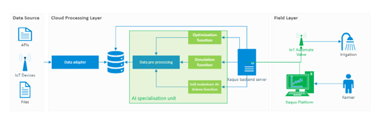

<!-- PROJECT LOGO -->
 

    

<!-- Matrix ai  -->

# XASMIS

# XASMIS
XASMIS is a revolutionary AI-driven soil moisture irrigation system capable of increasing crop yield by 22% while saving 12% of water. It is core features are:
* **ML Algorithm** XASMIS uses ML algorithms to predict the future levels of the soil for a specified location
* **Crop Simulations** XASMIS uses simulation capabilities to observe the possible effects of future soil moisture levels on the current irrigation schedule
* **Irrigation Parameters Optimisation** XASMIS uses optimisation algorithms to find the best irrigation set-up for a specific soil type, crop type, and crop growth stage.

# Architecture

 

    

<!-- ROADMAP -->
## Roadmap

- [x] Predict future soil moisture values
- [x] Simulate crop-growth
- [x] Optimise irrigation thresholds
- [x] Xaquo Web platform (https://www.xaquo.com/) 
- [x] Autonomous irrigation

